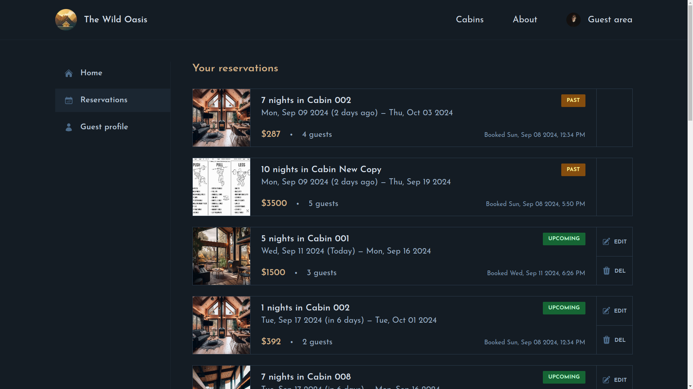

   

## About the Project

**Wild Oasis** is a secure and dynamic hotel reservation platform. It offers users a seamless experience to explore available cabins, make reservations effortlessly, and access a detailed history of their interactions. With robust authentication measures in place, users can confidently manage their bookings in a safe and user-friendly environment.

Credits goes to: **jonas-schmedtmann**

👉 Live demo: https://wild-oasis-website-inky.vercel.app/

### Built with:

- Reactjs
- NextJs
- NextAuth.js
- Tailwindcss
- Supabase
- ErrorBoundary for catching rendering errors
- postgres

## Demo
### vid todo

https://github.com/user-attachments/assets/7e8ca76d-3996-4b14-bb0e-6e59a5573cb4

## What I've learnt

1. How to set app router using Nextjs
2. How to use server actions
3. Authentication and Authorization using NextAuth.js
